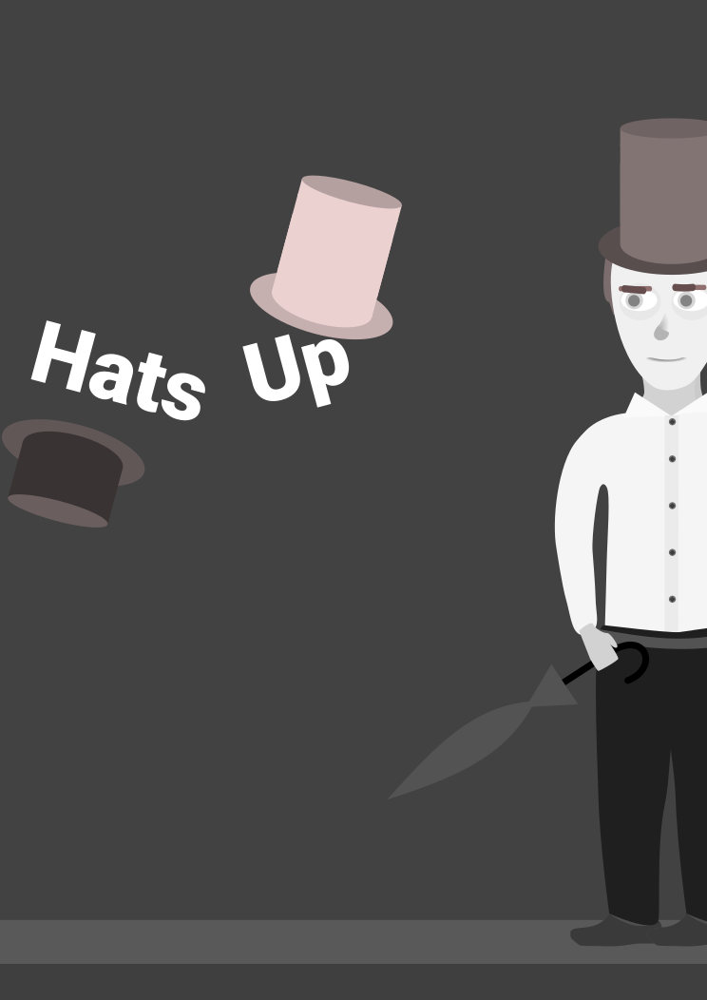

# Hats Up
A FOSS two-dimensional videogame platformer about hats that change player's gravity.
The game is planned to come out for free on Steam (app is already created), with source code available in distribution files and on GitHub.

## Current development state
### Concept art is in progress
The very first concept drawing:

The game engine is not yet chosen, but it is likely it would be custom-written.
